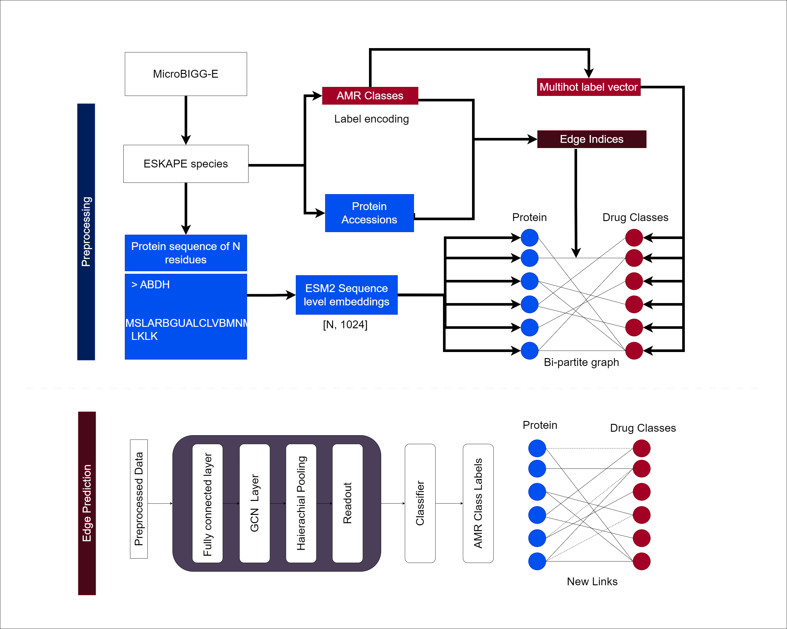

# GrAMR (WIP)

List of participants and affiliations:
- Ganeshiny Sridharan, University of Colombo  (Team Leader)
- Janith Weeraman, University of Calgary 
- Nimna Alupotha Gamage, University of Colombo
- Nuwan Medawaththa, University of Colombo

## Project Goals

Idenfity novel antibiotic resistances in organisms using graph representation learning (WIP)

## Approach (WIP)

## Results

## Future Work

## NCBI Codeathon Disclaimer
This software was created as part of an NCBI codeathon, a hackathon-style event focused on rapid innovation. While we encourage you to explore and adapt this code, please be aware that NCBI does not provide ongoing support for it.

For general questions about NCBI software and tools, please visit: [NCBI Contact Page](https://www.ncbi.nlm.nih.gov/home/about/contact/)

