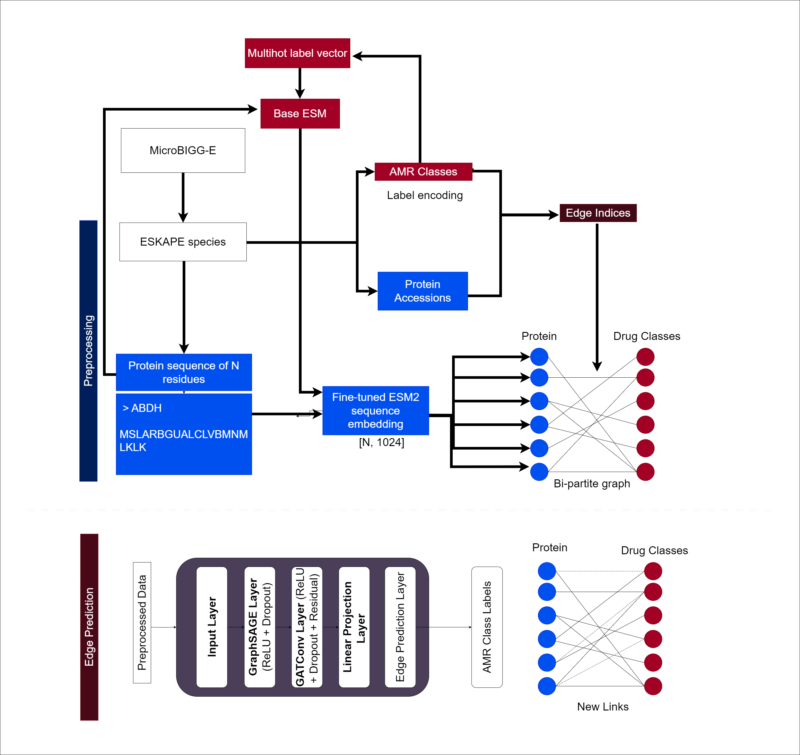

# GrAMR (WIP)

List of participants and affiliations:
- Ganeshiny Sridharan, University of Colombo  (Team Leader)
- Janith Weeraman, University of Calgary 
- Nimna Alupotha Gamage, University of Colombo
- Nuwan Medawaththa, University of Colombo
- Ruwanthika Premarathne, University of Colombo

## Project Goals

Idenfity novel antibiotic resistances in organisms using graph representation learning (WIP)

## Approach (WIP)

## Explanation of the workflow

The 'MicroBIGG-E' database was used to obtain AMR-related information, specifically focusing on the ESKAPE species. For each protein sequence, a FASTA-like structure is used, consisting of amino acids. These sequences serve as input for further steps. The Base ESM takes the protein sequences and produces embeddings representing each sequence in a high-dimensional space. The embeddings generated from the ESM model are further fine-tuned using ESM2. This embedding captures essential information about protein sequences for AMR prediction.

for batch embeddings
`import torch,os, gzip,pickle
from esm_embeddings import generate_embeddings`

The protein sequences are labeled according to different AMR classes. These labels are then label encoded, converting the categorical labels into numerical format for use in machine learning models. The AMR classes are represented as a multihot label vector. A bi-partite graph is constructed where one set of nodes represents proteins and the other set represents drug classes. Edges between protein nodes and drug class nodes represent interactions. 

After the bi-partite graph is constructed, the edge prediction task is handled by several layers. After the graph processing, a classifier is used to assign the AMR class labels to the protein sequences based on the predictions. This model attempts to predict the likelihood that a protein belongs to a particular AMR class. In the final step, new links (edges) are predicted between proteins and drug classes, indicating whether a protein is resistant to a specific drug class. These predicted edges form the basis of understanding the AMR protein-drug interactions.

## Results

## Future Work

## NCBI Codeathon Disclaimer
This software was created as part of an NCBI codeathon, a hackathon-style event focused on rapid innovation. While we encourage you to explore and adapt this code, please be aware that NCBI does not provide ongoing support for it.

For general questions about NCBI software and tools, please visit: [NCBI Contact Page](https://www.ncbi.nlm.nih.gov/home/about/contact/)

